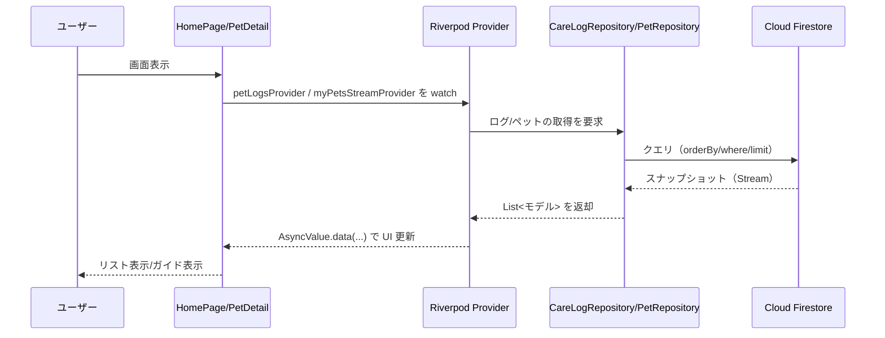

# Pettime（名称：ペットタイム）

Flutter + Firebase のスケルトン。Auth（メール/パスワード）、ルーター、Firestore リポジトリ（pets/logs）を含みます。

## セットアップ

1) Firebase プロジェクトの紐付け

```powershell
dart pub global activate flutterfire_cli
flutterfire configure
```

これで `lib/firebase_options.dart` が生成されます。`main.dart` の TODO を解除して

```dart
await Firebase.initializeApp(options: DefaultFirebaseOptions.currentPlatform);
```

を有効化してください。

2) 依存解決と起動

```powershell
dart pub get
flutter run
```

## ディレクトリ

- `lib/pages/` サインイン・ホームのページ
- `lib/features/auth/` 認証コントローラ
- `lib/data/repositories/` Firestore連携のリポジトリ（スタブ）

## Firestore コレクション構造 (現状実装)

```
pets/{petId}
	name: string
	members: string[] (UID array)
	photoUrl?: string
	# ペットケア記録（Pettime）

	Flutter + Firebase で作る家族向けペットケア記録アプリのサンプル実装です。メール/パスワード認証、ルーティング、Firestore リポジトリ（pets/logs）、Riverpod による状態管理を含みます。

	## 技術スタック

	- Flutter / Dart（Riverpod 3, go_router）
	- Firebase（Auth, Cloud Firestore）
	- freezed / json_serializable（モデル＆シリアライズ）
	- Mermaid（README での構成図表現）
pets/{petId}/logs/{logId}
	type: 'walk' | 'feed' | 'clinic'
	1) Firebase プロジェクトの紐付け（`firebase_options.dart` 生成）
	photoUrl?: string
	at: Timestamp   (記録日時)
	createdBy: string (UID)
	createdAt: Timestamp (作成時刻)
```

	実行後、`lib/firebase_options.dart` が生成されます。`main.dart` はこの設定を自動で読み込み、Firebase を初期化します。

	2) 依存解決と起動


以下は概念例です。実運用では追加でバリデーション（配列長・文字数制限など）を行ってください。

```js

	3) テスト実行（任意）

	```powershell
	flutter test
	```
rules_version = '2';
service cloud.firestore {
	## データモデル / Firestore コレクション構造（現状）
		function isSignedIn() { return request.auth != null; }
		function uid() { return request.auth.uid; }

		match /pets/{petId} {
			allow read: if isSignedIn() && (uid() in resource.data.members);
			allow create: if isSignedIn() && request.resource.data.members.hasOnly([uid()]) &&
				request.resource.data.name is string && request.resource.data.members is list;
			allow update, delete: if isSignedIn() && (uid() in resource.data.members);

	- ホーム（ペット一覧 & 追加ダイアログ）
		- ローディング表示 / エラー（再試行）/ 空データのガイド表示
		- 右下の + FAB から名前（必須・30文字以内）を入力して追加
	- ペット詳細 & ログ管理
		- ログ一覧（散歩・ごはん・病院）／種類・期間フィルタ
		- ログの追加・編集・削除
		- 画像添付は非対応（Storage 非利用方針）
	- 統計情報
		- 総記録数・記録期間・各タイプの件数・最終記録日時を表示
		- データがない場合のガイド表示
	- 週間サマリー
		- 過去7日間の概要（タイプ別合計）、日毎カード表示、今日のハイライト
	- ログ検索
		- メモ内容を対象にリアルタイム検索、件数表示、結果一覧

			match /logs/{logId} {
				allow read: if isSignedIn() && (uid() in get(/databases/$(database)/documents/pets/$(petId)).data.members);
				allow create: if isSignedIn() && (uid() in get(/databases/$(database)/documents/pets/$(petId)).data.members);

## インデックス（必要になり得るもの）
- `pets` コレクション: members の array-contains クエリ（自動）
- `pets/{petId}/logs` コレクション: orderBy at desc + limit（単一フィールドは自動）

複合クエリを追加した際にエラーメッセージからリンク経由で作成してください。

## メール/パスワード認証の利用方法

1. Firebaseコンソール Authentication で Email/Password を有効化
2. アプリ起動 → フォームにメール & 6文字以上のパスワード → 新規登録
3. 成功後ホーム（サインアウトは右上ボタン）
4. ログインは同フォームで「既にアカウントがあります」をクリック

## ペット一覧 & 追加ダイアログ (実装済)

ホーム画面で以下の状態遷移を行います:

- ローディング: 円形プログレスを中央表示
- エラー: メッセージ + 再試行ボタン
- データなし: 「まだペットが登録されていません」ガイド表示
- データあり: ListView (アイコン / 名前 / メンバー数)

右下の + FAB を押すとペット追加ダイアログが開き、名前(必須, 30字以内)を入力して「追加」で Firestore `pets` にドキュメントを作成します。作成後は自動で一覧へ反映されます。

## ペット詳細 & ログ管理 (実装済)

ペット一覧からペットをタップすると詳細画面に遷移します:

- ログ一覧表示（散歩・ごはん・病院の記録）
- ログの種類・期間でのフィルタリング
- ログの追加・編集・削除
- 画像添付は現在未対応（Storage 非利用方針）

## 統計情報 (実装済)

ペット詳細画面の右上の統計アイコンから統計情報ページへアクセスできます:

- 総記録数と記録期間の表示
- 各ケアタイプ（散歩・ごはん・病院）ごとの記録数
- 各ケアタイプの最終記録日時の表示
- データがない場合のガイド表示

## 週間サマリー (実装済)

ペット詳細画面の右上のカレンダーアイコンから週間サマリーページへアクセスできます:

- 過去7日間のケア記録の概要表示
- 各ケアタイプの合計回数をバッジで表示
- 日ごとのケア記録をカード形式で一覧表示
- 今日の記録をハイライト表示

## ログ検索 (実装済)

ペット詳細画面の右上の検索アイコンからログ検索ページへアクセスできます:

- メモの内容からログを検索
- リアルタイム検索（入力と同時に結果を更新）
- 検索結果件数の表示
- 検索にヒットしたログの一覧表示

## 構成図（Flutter + Firebase 連携）

以下は、本アプリが Flutter（UI/状態管理/リポジトリ層）と Firebase（Auth/Firestore）でどのように連携しているかを示す構成図です。

```mermaid
flowchart LR
	subgraph App[Flutter App]
		direction TB
		R[go_router
		(画面遷移)]
		P[Pages
		(SignIn/Home/
		PetDetail/
		WeeklySummary/
		LogSearch)]
		S[Riverpod Providers
		・authStateProvider
		・authControllerProvider
		・myPetsStreamProvider
		・petLogsProvider
		・petStatisticsProvider]
		Repo[Repositories
		・AuthService
		・PetRepository
		・CareLogRepository]
	end

	subgraph Firebase[Firebase]
		direction TB
		Auth[Firebase Auth
		・Email/Password
		・(Google Sign-In 予定)]
		FS[Cloud Firestore
		・pets/{petId}
		・logs/{logId}]
		FCM[(FCM 通知 予定)]
	end

	%% 主要なデータフロー
	P -->|watch/sign-in 操作| S
	S -->|依存注入/状態| Repo
	Repo -->|CRUD/Query| FS
	Repo -->|signIn/SignOut| Auth
	FS -->|Stream snapshots| Repo
	Repo -->|結果を返却| S
	S -->|AsyncValue をUI反映| P
	R --> P

	%% 参考: 将来拡張
	P -. 通知受信 .-> FCM
```

### 説明
- Pages: 画面（サインイン/ホーム/詳細/週間サマリー/検索）
- Providers: Riverpod による状態/非同期データ（Auth 状態、ペット一覧、ログ一覧、統計など）
- Repositories: Firebase へのアクセスを集約（AuthService, PetRepository, CareLogRepository）
- Firebase Auth: メール/パスワード（将来的に Google Sign-In 追加）
- Cloud Firestore: `pets` コレクションと `pets/{petId}/logs` サブコレクション
- FCM: 通知（今後追加予定）

### データフロー例（ログ表示）



## 次のステップ候補

- ~~統計情報画面: ケアログの記録数・最終記録日などの可視化~~ (実装済)
- 画像アップロード（Storage）: 非対応（コスト/プラン要件のため）
- グラフ表示: 週次・月次のケアログ推移をチャート表示
- Cloud Functions: ペット削除時に logs サブコレクション一括削除
- 通知（FCM）: 散歩リマインダー等
- Google サインイン追加
- カレンダー表示: ログをカレンダー形式で表示
- エクスポート機能: ログをPDFやCSVで出力


## セキュリティルール（Firestore）

このプロジェクトでは、以下の場所にルールファイルを配置しています。

- Firestore: `firestore.rules`

### デプロイ手順（Firebase CLI）

事前に Firebase CLI ログインとプロジェクト選択を済ませてください。

```powershell
firebase.cmd login --no-localhost
firebase.cmd use pet-time-7398c

# Firestore ルールデプロイ
firebase.cmd deploy --only firestore:rules
```

メモ: PowerShell では実行ポリシーにより `firebase.ps1` がブロックされる場合があります。その場合は `firebase.cmd` を利用してください。


