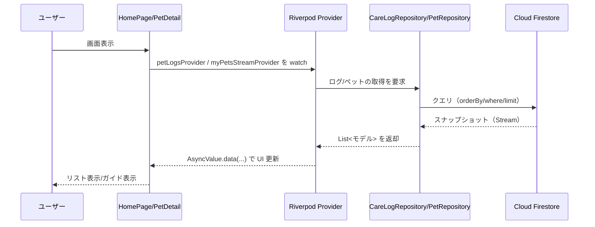

<h1 align="center">Pettime（名称：ペットタイム）</h1>

ペットの散歩・食事・通院の記録を残すアプリです。 
過去の特定の期間の記録を検索することが可能です。

参考画像: Pettime - スプラッシュ・ホーム画像

## ディレクトリ

- `lib/data/` : Firestore, Riverpodなど
- `lib/features/` : 認証コントローラー
- `lib/models/` : サーバーサイド
- `lib/pages/` : クライアントサイド

### 説明
- Pages: 画面（サインイン/ホーム/詳細/週間サマリー/検索）
- Providers: Riverpod による状態/非同期データ（Auth 状態、ペット一覧、ログ一覧、統計など）
- Repositories: Firebase へのアクセスを集約（AuthService, PetRepository, CareLogRepository）
- Firebase Auth: メール/パスワード（将来的に Google Sign-In 追加）
- Cloud Firestore: `pets` コレクションと `pets/{petId}/logs` サブコレクション
- FCM: 通知（今後追加予定）

## データフロー（例：ログ表示）

